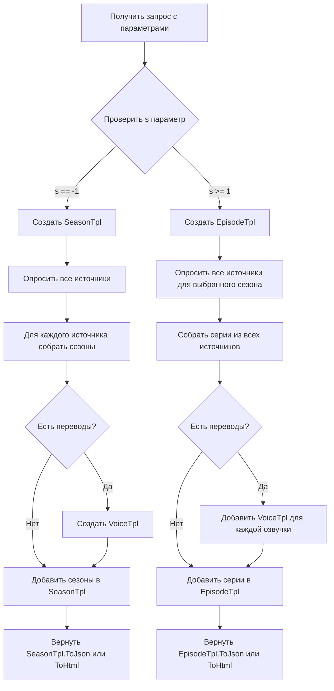

Первым делом Изучи Документацию и всю что нужно в этом репозитории - https://github.com/immisterio/Lampac

# План реализации агрегатора сериалов

Я изучил кодовую базу Lampac и нашел, как реализована работа с сериалами. Вот подробная логика, которую вы можете использовать:

## Основная архитектура

В Lampac используется трёхуровневая структура для сериалов:

1. **Сезоны** → 2. **Переводы/Озвучки** (опционально) → 3. **Серии**

Для этого используются три шаблонных класса: [1](#0-0) [2](#0-1) [3](#0-2) 

## Логика работы по параметру `s`

Ключевая логика построена на параметре `s` (season):

**Когда `s == -1`** → отображаем список сезонов: [4](#0-3) 

**Когда `s >= 1`** → отображаем серии выбранного сезона: [5](#0-4) 

## Детальный пример из Rezka

Более сложный пример с поддержкой переводов показан в Rezka:

**1. Проверка на тип контента (фильм или сериал):** [6](#0-5) 

**2. Если сериал - собираем переводы:** [7](#0-6) 

**3. Создаём шаблоны для сезонов и серий:** [8](#0-7) 

**4. Логика рендеринга сезонов (s == -1):** [9](#0-8) 

**5. Логика рендеринга серий (s >= 1):** [10](#0-9) 

**6. Возврат результата:** [11](#0-10) 

## Агрегация нескольких источников

Для агрегации всех источников используется endpoint `/lite/events`: [12](#0-11) 

Каждый источник возвращает свою ссылку в формате:

```
{host}/lite/{provider}?title={title}&s=-1  // для сезонов
{host}/lite/{provider}?title={title}&s=1   // для серий 1 сезона
```

## Алгоритм реализации

Вот пошаговый план для вашего агрегатора:



## Практическая реализация

**Шаг 1:** Создайте метод контроллера с параметром `s`:

```csharp
public async Task<ActionResult> Index(string title, int s = -1, bool rjson = false)
```

**Шаг 2:** Разделите логику по значению `s`:

- `s == -1` → собирайте сезоны через `SeasonTpl.Append(название_сезона, ссылка, номер_сезона)`
- `s >= 1` → собирайте серии через `EpisodeTpl.Append(название_серии, title, сезон, серия, ссылка, "call")`

**Шаг 3:** Если есть несколько озвучек, используйте `VoiceTpl.Append(название_озвучки, активна, ссылка)`

**Шаг 4:** Возвращайте результат через `ToJson()` или `ToHtml()` в зависимости от параметра `rjson`

## Notes

Ключевые моменты:
- Параметр `s` управляет всей навигацией: `-1` = сезоны, `>= 1` = серии конкретного сезона
- Все шаблоны имеют методы `ToJson()` и `ToHtml()` для унифицированного вывода
- VoiceTpl можно передать в `ToJson(vtpl)` или `ToHtml(vtpl)` для включения в финальный результат
- Каждый источник возвращает свои ссылки, агрегация происходит на уровне списка источников в `/lite/events`
- Для агрегации достаточно собрать URL всех источников и вернуть их списком, а переключение между сезонами/сериями происходит через параметр `s` в URL

### Citations

**File:** Shared/Models/Templates/SeasonTpl.cs (L8-35)
```csharp
    public struct SeasonTpl
    {
        public List<(string name, string link, int? id)> data { get; set; }

        public string quality = null;

        public SeasonTpl() : this(10) { }

        public SeasonTpl(int capacity) { data = new List<(string, string, int?)>(capacity); }

        public SeasonTpl(string quality, int capacity = 10) 
        {
            data = new List<(string, string, int?)>(capacity);
            this.quality = quality; 
        }

        public void Append(string name, string link, string id)
        {
            int.TryParse(id, out int sid);
            Append(name, link, sid);
        }

        public void Append(string name, string link, int id)
        {
            if (!string.IsNullOrEmpty(name))
                data.Add((name, link, id));
        }

```

**File:** Shared/Models/Templates/VoiceTpl.cs (L7-19)
```csharp
    public struct VoiceTpl
    {
        public List<(string name, bool active, string link)> data { get; set; }

        public VoiceTpl() : this(15) { }

        public VoiceTpl(int capacity) { data = new List<(string, bool, string)>(capacity); }

        public void Append(string name, bool active, string link)
        {
            if (!string.IsNullOrEmpty(name))
                data.Add((name, active, link));
        }
```

**File:** Shared/Models/Templates/EpisodeTpl.cs (L9-24)
```csharp
    public struct EpisodeTpl
    {
        public List<(string name, string title, string s, string e, string link, string method, StreamQualityTpl? streamquality, SubtitleTpl? subtitles, string streamlink, string voice_name, VastConf vast, List<HeadersModel> headers, int? hls_manifest_timeout)> data { get; set; }

        public EpisodeTpl() : this(20) { }

        public EpisodeTpl(int capacity) 
        {
            data = new List<(string, string, string, string, string, string, StreamQualityTpl?, SubtitleTpl?, string, string, VastConf, List<HeadersModel>, int?)>(capacity);
        }

        public void Append(string name, string title, string s, string e, string link, string method = "play", in StreamQualityTpl? streamquality = null, in SubtitleTpl? subtitles = null, string streamlink = null, string voice_name = null, VastConf vast = null, List<HeadersModel> headers = null, int? hls_manifest_timeout = null)
        {
            if (!string.IsNullOrEmpty(name) && !string.IsNullOrEmpty(link))
                data.Add((name, $"{title} ({e} серия)", s, e, link, method, streamquality, subtitles, streamlink, voice_name, vast, headers, hls_manifest_timeout));
        }
```

**File:** Online/Controllers/Videoseed.cs (L94-105)
```csharp
                    if (s == -1)
                    {
                        var tpl = new SeasonTpl(cache.seasons.Count);

                        foreach (var season in cache.seasons)
                        {
                            string link = $"{host}/lite/videoseed?rjson={rjson}&kinopoisk_id={kinopoisk_id}&imdb_id={imdb_id}&title={enc_title}&original_title={enc_original_title}&s={season.Key}";
                            tpl.Append($"{season.Key} сезон", link, season.Key);
                        }

                        return ContentTo(rjson ? tpl.ToJson() : tpl.ToHtml());
                    }
```

**File:** Online/Controllers/Videoseed.cs (L106-121)
```csharp
                    else
                    {
                        string sArhc = s.ToString();
                        var videos = cache.seasons.First(i => i.Key == sArhc).Value["videos"].ToObject<Dictionary<string, JObject>>();

                        var etpl = new EpisodeTpl(videos.Count);

                        foreach (var video in videos)
                        {
                            string iframe = video.Value.Value<string>("iframe");
                            etpl.Append($"{video.Key} серия", title ?? original_title, sArhc, video.Key, accsArgs($"{host}/lite/videoseed/video/{AesTo.Encrypt(iframe)}"), "call", vast: init.vast);
                        }

                        return ContentTo(rjson ? etpl.ToJson() : etpl.ToHtml());
                    }
                    #endregion
```

**File:** Shared/Engine/Online/Rezka.cs (L271-272)
```csharp
            if (!result.content.Contains("data-season_id="))
            {
```

**File:** Shared/Engine/Online/Rezka.cs (L345-377)
```csharp
                #region Перевод
                var vtpl = new VoiceTpl();

                if (result.content.Contains("data-translator_id="))
                {
                    var match = new Regex("<[a-z]+ [^>]+ data-translator_id=\"(?<translator>[0-9]+)\"([^>]+)?>(?<name>[^<]+)([^\"]+)\" [^>]+/>)?").Match(result.content);
                    while (match.Success)
                    {
                        if (!userprem && match.Groups[0].Value.Contains("prem_translator"))
                        {
                            match = match.NextMatch();
                            continue;
                        }

                        string name = match.Groups["name"].Value.Trim();
                        if (!string.IsNullOrEmpty(match.Groups["imgname"].Value) && !name.ToLower().Contains(match.Groups["imgname"].Value.ToLower().Trim()))
                            name += $" ({match.Groups["imgname"].Value})";

                        string link = host + $"lite/rezka/serial?rjson={rjson}&title={enc_title}&original_title={enc_original_title}&href={enc_href}&id={result.id}&t={match.Groups["translator"].Value}";

                        string voice_href = Regex.Match(match.Groups[0].Value, "href=\"(https?://[^/]+)?/([^\"]+)\"").Groups[2].Value;
                        if (!string.IsNullOrEmpty(voice_href) && init.ajax != null && init.ajax.Value == false)
                        {
                            string voice = HttpUtility.UrlEncode(voice_href);
                            link = host + $"lite/rezka?rjson={rjson}&title={enc_title}&original_title={enc_original_title}&href={voice}&id={result.id}&t={match.Groups["translator"].Value}";
                        }

                        vtpl.Append(name, match.Groups["translator"].Value == trs, link);

                        match = match.NextMatch();
                    }
                }
                #endregion
```

**File:** Shared/Engine/Online/Rezka.cs (L379-381)
```csharp
                var tpl = new SeasonTpl();
                var etpl = new EpisodeTpl();
                HashSet<string> eshash = new HashSet<string>();
```

**File:** Shared/Engine/Online/Rezka.cs (L388-399)
```csharp
                    if (s == -1)
                    {
                        #region Сезоны
                        string sname = $"{m.Groups["season"].Value} сезон";
                        if (!string.IsNullOrEmpty(m.Groups["season"].Value) && !eshash.Contains(sname))
                        {
                            eshash.Add(sname);
                            string link = host + $"lite/rezka?rjson={rjson}&title={enc_title}&original_title={enc_original_title}&href={enc_href}&t={trs}&s={m.Groups["season"].Value}";

                            tpl.Append(sname, link, m.Groups["season"].Value);
                        }
                        #endregion
```

**File:** Shared/Engine/Online/Rezka.cs (L401-423)
```csharp
                    else
                    {
                        #region Серии
                        if (m.Groups["season"].Value == s.ToString() && !eshash.Contains(m.Groups["name"].Value))
                        {
                            eshash.Add(m.Groups["name"].Value);
                            string link = host + $"lite/rezka/movie?title={enc_title}&original_title={enc_original_title}&id={result.id}&t={trs}&s={s}&e={m.Groups["episode"].Value}";

                            string voice_href = Regex.Match(m.Groups[0].Value, "href=\"(https?://[^/]+)?/([^\"]+)\"").Groups[2].Value;
                            if (!string.IsNullOrEmpty(voice_href))
                                link += $"&voice={HttpUtility.UrlEncode(voice_href)}";

                            string stream = null;
                            if (showstream)
                            {
                                stream = usehls ? $"{link.Replace("/movie", "/movie.m3u8")}&play=true" : $"{link}&play=true";
                                stream += args;
                            }

                            etpl.Append(m.Groups["name"].Value, title ?? original_title, sArhc, m.Groups["episode"].Value, link, "call", streamlink: stream);
                        }
                        #endregion
                    }
```

**File:** Shared/Engine/Online/Rezka.cs (L428-434)
```csharp
                if (rjson)
                    return s == -1 ? tpl.ToJson(vtpl) : etpl.ToJson(vtpl);

                if (s == -1)
                    return vtpl.ToHtml() + tpl.ToHtml();

                return vtpl.ToHtml() + etpl.ToHtml();
```

**File:** Online/OnlineApi.cs (L594-598)
```csharp
        [Route("lite/events")]
        async public ValueTask<ActionResult> Events(long id, string imdb_id, long kinopoisk_id, string title, string original_title, string original_language, int year, string source, string rchtype, int serial = -1, bool life = false, bool islite = false, string account_email = null, string uid = null, string token = null)
        {
            var online = new List<(dynamic init, string name, string url, string plugin, int index)>(50);
            bool isanime = original_language is "ja" or "zh";
```
Wiki pages you might want to explore:
- [Key Features and Content Sources (immisterio/Lampac)](/wiki/immisterio/Lampac#1.2)

### Citations

**File:** Shared/Engine/Online/Lumex.cs (L223-234)
```csharp
                    if (s == -1)
                    {
                        var tpl = new SeasonTpl(result.media.Length);

                        foreach (var media in result.media.OrderBy(s => s.season_id))
                        {
                            string link = host + $"lite/lumex?content_id={content_id}&content_type={content_type}&kinopoisk_id={kinopoisk_id}&imdb_id={imdb_id}&rjson={rjson}&title={enc_title}&original_title={enc_original_title}&clarification={clarification}&s={media.season_id}{args}";    

                            tpl.Append($"{media.season_id} сезон", link, media.season_id);
                        }

                        return rjson ? tpl.ToJson() : tpl.ToHtml();
```

**File:** Shared/Engine/Online/Lumex.cs (L238-262)
```csharp
                        #region Перевод
                        var vtpl = new VoiceTpl();
                        var tmpVoice = new HashSet<int>();

                        foreach (var media in result.media)
                        {
                            if (media.season_id != s)
                                continue;

                            foreach (var episode in media.episodes)
                            {
                                foreach (var voice in episode.media)
                                {
                                    if (tmpVoice.Contains(voice.translation_id))
                                        continue;

                                    tmpVoice.Add(voice.translation_id);

                                    if (string.IsNullOrEmpty(t))
                                        t = voice.translation_id.ToString();

                                    vtpl.Append(voice.translation_name, t == voice.translation_id.ToString(), host + $"lite/lumex?content_id={content_id}&content_type={content_type}&kinopoisk_id={kinopoisk_id}&imdb_id={imdb_id}&rjson={rjson}&title={enc_title}&original_title={enc_original_title}&clarification={clarification}&s={s}&t={voice.translation_id}");
                                }
                            }
                        }
```

**File:** Shared/Engine/Online/Lumex.cs (L268-305)
```csharp
                        var etpl = new EpisodeTpl();
                        string sArhc = s.ToString();

                        foreach (var media in result.media)
                        {
                            if (media.season_id != s)
                                continue;

                            foreach (var episode in media.episodes)
                            {
                                foreach (var voice in episode.media)
                                {
                                    if (voice.translation_id.ToString() != t)
                                        continue;

                                    var subtitles = new SubtitleTpl(media.subtitles?.Length ?? 0);
                                    if (media.subtitles != null && media.subtitles.Length > 0)
                                    {
                                        foreach (string srt in media.subtitles)
                                        {
                                            string name = Regex.Match(srt, "/([^\\.\\/]+)\\.srt").Groups[1].Value;
                                            subtitles.Append(name, onstream($"{scheme}:{srt}"));
                                        }
                                    }

                                    string link = host + $"lite/lumex/video.m3u8?playlist={HttpUtility.UrlEncode(voice.playlist)}&csrf={result.csrf}&max_quality={voice.max_quality}{args}";

                                    if (bwa || !hls)
                                    {
                                        etpl.Append($"{episode.episode_id} серия", title ?? original_title, sArhc, episode.episode_id.ToString(), link.Replace(".m3u8", ""), "call", subtitles: subtitles);
                                    }
                                    else
                                    {
                                        etpl.Append($"{episode.episode_id} серия", title ?? original_title, sArhc, episode.episode_id.ToString(), link, subtitles: subtitles);
                                    }
                                }
                            }
                        }
```

**File:** Shared/Engine/Online/VDBmovies.cs (L208-228)
```csharp
                    var vtpl = new VoiceTpl();
                    var etpl = new EpisodeTpl();

                    var hashvoices = new HashSet<string>();

                    string sArhc = s.ToString();

                    foreach (var episode in root.serial[sid].folder)
                    {
                        string ename = Regex.Match(episode.title, "^([0-9]+)").Groups[1].Value;

                        foreach (var voice in episode.folder)
                        {
                            string perevod = voice.title;
                            if (string.IsNullOrEmpty(t))
                                t = perevod;

                            if (!hashvoices.Contains(perevod))
                            {
                                hashvoices.Add(perevod);
                                vtpl.Append(perevod, t == perevod, host + $"lite/vdbmovies?orid={orid}&imdb_id={imdb_id}&kinopoisk_id={kinopoisk_id}&rjson={rjson}&title={enc_title}&original_title={enc_original_title}&s={s}&sid={sid}&t={HttpUtility.UrlEncode(perevod)}");
```

**File:** Shared/Engine/Online/KinoPub.cs (L270-310)
```csharp
                        #region Перевод
                        var vtpl = new VoiceTpl();
                        var hash = new HashSet<string>();

                        foreach (var a in root.item.seasons.First(i => i.number == s).episodes[0].audios)
                        {
                            string voice = a?.author?.title ?? a?.type?.title;

                            int? idt = a?.author?.id;
                            if (idt == null)
                                idt = a?.type?.id ?? null;

                            if (idt == null)
                            {
                                if (a.lang == "eng")
                                {
                                    idt = 6;
                                    voice = "Оригинал";
                                }
                                else
                                {
                                    idt = 1;
                                    voice = "По умолчанию";
                                }
                            }

                            if (string.IsNullOrEmpty(voice))
                                continue;

                            if (t == -1)
                            {
                                t = (int)idt;
                                codec = a.codec;
                            }

                            if (!hash.Contains($"{voice}:{a.codec}"))
                            {
                                hash.Add($"{voice}:{a.codec}");

                                string link = host + $"lite/kinopub?rjson={rjson}&postid={postid}&title={enc_title}&original_title={enc_original_title}&s={s}&t={idt}&codec={a.codec}";
                                bool active = t == idt && (codec == null || codec == a.codec);
```

Да, ваша текущая реализация **должна работать**, но есть несколько причин, почему может ничего не отображаться<cite/>:

## Возможные проблемы

### 1. Проверьте формат ответа провайдеров

Ваш код ожидает JSON с полями `type` и `data`<cite/>. Убедитесь, что провайдеры Lampac возвращают именно такой формат:

```json
{
  "type": "season",
  "data": [...]
}
```

В Lampac провайдеры возвращают разные форматы<cite/>. Например, Lumex возвращает через `SeasonTpl.ToJson()` [1](#3-0) , который создает структуру с `playlist` вместо `data`<cite/>:

```json
{
  "playlist": [
    {"id": 1, "title": "1 сезон", ...}
  ]
}
```

### 2. Проблема с `ExtractItems`

Ваш метод `ExtractItems` ищет поле `data`, но многие провайдеры используют другие поля<cite/>:
- `playlist` - для сезонов в Filmix [2](#3-1) 
- `episodes` - для серий в некоторых провайдерах
- `results` - альтернативное поле

**Решение:** Ваш код уже обрабатывает эти случаи в `ExtractItems`, но проверьте, что он правильно извлекает данные<cite/>.

### 3. Режим "similar" блокирует отображение

Если `serial == 1` и `providerFilter` пустой, ваш код возвращает режим `"similar"` (список провайдеров)<cite/>:

```csharp
if (serial == 1 && string.IsNullOrWhiteSpace(providerFilter) && requestedSeason <= 0)
    return "similar";
```

Это означает, что **сначала пользователь должен выбрать провайдер**, а только потом увидит сезоны<cite/>. Проверьте, что Lampa правильно отображает список провайдеров.

### 4. Отсутствие `method` в элементах

Lampa ожидает поле `method: "link"` для навигации<cite/>. Ваш `NormalizeSeasonItem` добавляет его, но только для сезонов<cite/>. Убедитесь, что все элементы имеют это поле.

## Отладка

Добавьте логирование в ключевых местах:

```csharp
// В BuildAggregationData
Console.WriteLine($"BuildAggregationData: expectedType={expectedType}, results={providerResults.Count}");

// В MergePayloads
Console.WriteLine($"MergePayloads: aggregated {aggregated.Count} items");

// В ExtractItems
Console.WriteLine($"ExtractItems: payload type={payload.GetType().Name}, expectedType={expectedType}");
```

Проверьте:
1. Что `/lite/events` возвращает список провайдеров<cite/>
2. Что каждый провайдер возвращает валидный JSON с `type` и данными<cite/>
3. Что `BuildAggregationData` создает непустой массив<cite/>
4. Что финальный JSON содержит поле `data` с элементами<cite/>

## Пример правильного ответа

Для сезонов (`s == -1`):
```json
{
  "type": "season",
  "data": [
    {
      "id": 1,
      "name": "1 сезон",
      "method": "link",
      "url": "http://host/lite/smartfilter?...&s=1",
      "provider": "Lumex"
    }
  ]
}
```

Для серий (`s >= 1`):
```json
{
  "type": "episode",
  "data": [
    {
      "title": "1 серия",
      "url": "http://...",
      "episode": 1,
      "provider": "Lumex"
    }
  ]
}
```

## Notes

Основная проблема скорее всего в том, что провайдеры Lampac используют разные форматы JSON<cite/>. Ваш код пытается их нормализовать через `ExtractItems` и `NormalizeSeasonItem`, но может не покрывать все случаи<cite/>. Рекомендую:

1. Проверить логи консоли - там должны быть сообщения от `Console.WriteLine`<cite/>
2. Посмотреть сырой JSON от провайдеров через `/lite/{provider}?rjson=true`<cite/>
3. Убедиться, что `DetermineContentType` возвращает правильный тип<cite/>
4. Проверить, что `MergePayloads` не возвращает пустой массив<cite/>

Если проблема сохраняется, покажите пример JSON, который возвращает один из провайдеров, и я помогу адаптировать код под этот формат<cite/>.

Wiki pages you might want to explore:
- [Key Features and Content Sources (immisterio/Lampac)](/wiki/immisterio/Lampac#1.2)

### Citations

**File:** Online/Controllers/Lumex.cs (L14-27)
```csharp
        #region database
        static List<DatumDB> databaseCache;

        public static IEnumerable<DatumDB> database
        {
            get
            {
                if (AppInit.conf.multiaccess || databaseCache != null)
                    return databaseCache ??= JsonHelper.ListReader<DatumDB>("data/lumex.json", 105000);

                return JsonHelper.IEnumerableReader<DatumDB>("data/lumex.json");
            }
        }
        #endregion
```

**File:** Shared/Engine/Online/Filmix.cs (L331-361)
```csharp
                    if (!streamquality.Any())
                        continue;

                    mtpl.Append(v.translation, streamquality.Firts().link, streamquality: streamquality, vast: vast);
                }

                return rjson ? mtpl.ToJson() : mtpl.ToHtml();
                #endregion
            }
            else
            {
                #region Сериал
                if (player_links.playlist == null || player_links.playlist.Count == 0)
                    return string.Empty;

                string enc_title = HttpUtility.UrlEncode(title);
                string enc_original_title = HttpUtility.UrlEncode(original_title);

                if (s == null)
                {
                    #region Сезоны
                    var tpl = new SeasonTpl(!string.IsNullOrEmpty(root?.quality) ? $"{root.quality.Replace("+", "")}p" : null, player_links.playlist.Count);

                    foreach (var season in player_links.playlist)
                    {
                        string link = host + $"lite/filmix?rjson={rjson}&postid={postid}&title={enc_title}&original_title={enc_original_title}&s={season.Key}";
                        tpl.Append($"{season.Key.Replace("-1", "1")} сезон", link, season.Key);
                    }

                    return rjson ? tpl.ToJson() : tpl.ToHtml();
                    #endregion
```